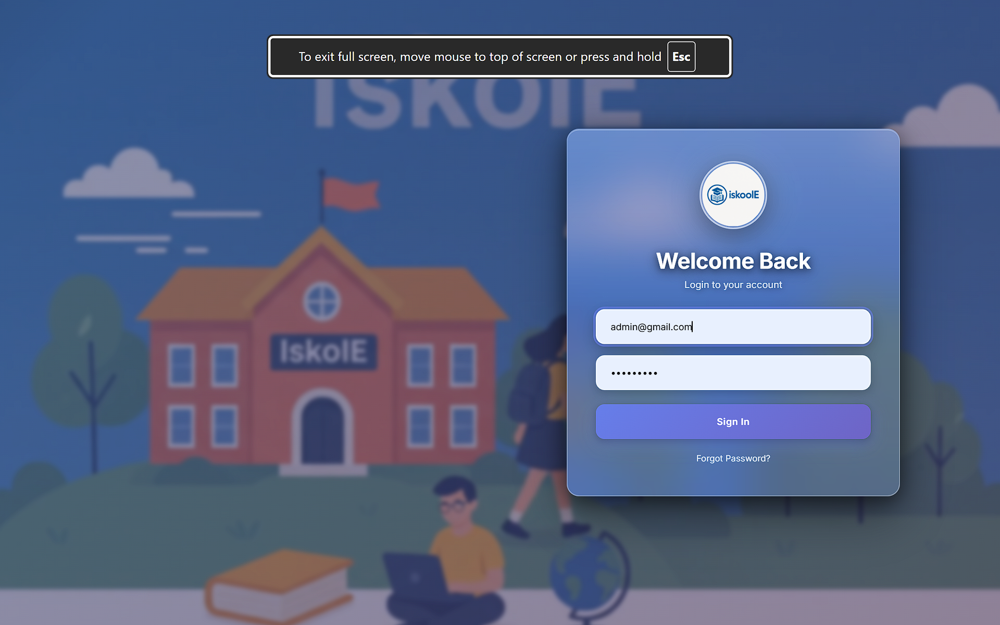
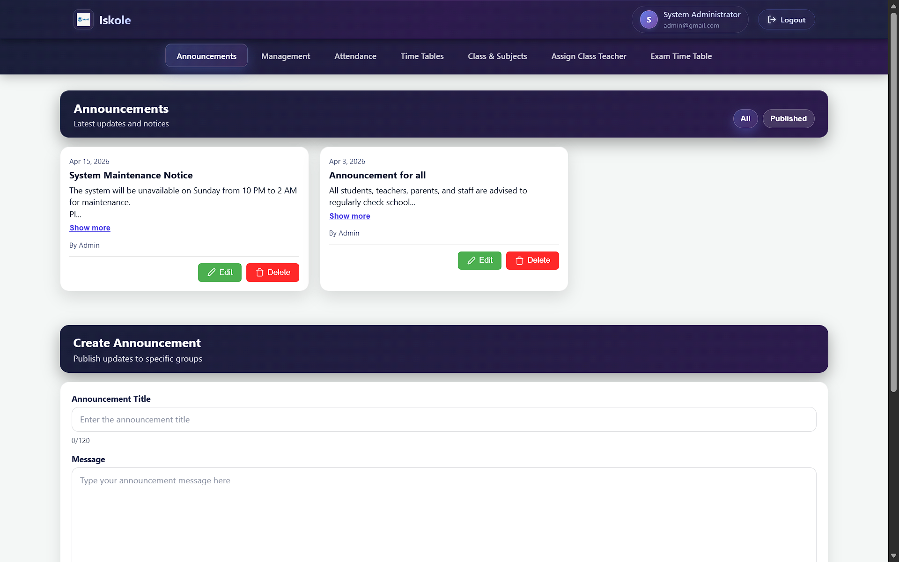
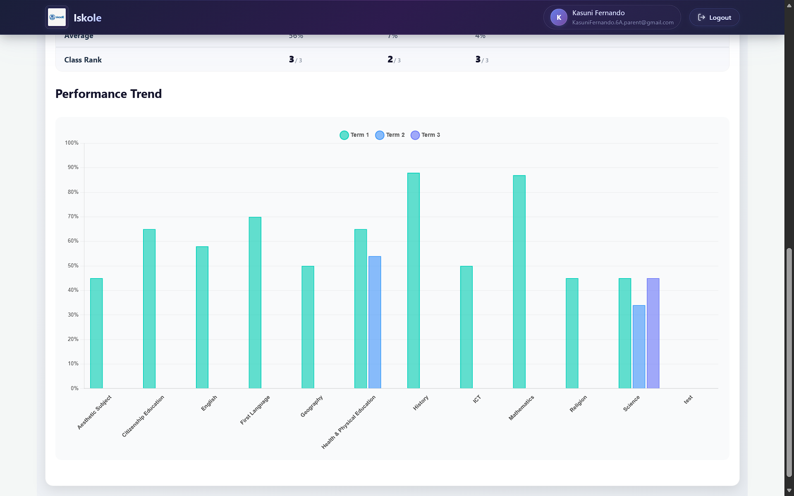
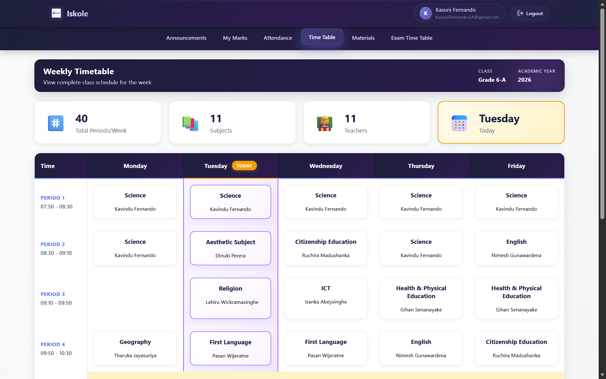

# IskolE - School Management System

IskolE is a web-based School Management System (SMS) built for Sri Lankan schools to streamline academic, administrative, and communication workflows.

It centralizes marks and reports, attendance and leave, timetables, announcements, learning materials, and academic insights with role-based access for Administrators, Management Panel users, Teachers, Parents, and Students.

## Team

- Seniru D S Senaweera
- R K K Jinendra
- R. S. R. G. A. A. Ananda
- S. K. Thasindu Ramsitha

## Key Features

### Administrator

- Manage management staff records (CRUD)
- Manage teacher records (CRUD)
- Manage student records (CRUD)
- Manage parent/guardian records (CRUD)
- Manage grades, classes, and subjects
- Assign teachers to classes

### Management Panel

- Secure login and role-based dashboard access
- CRUD operations for student, parent, and staff records
- Broadcast announcements to selected audiences
- Monitor attendance data
- Review teacher leave requests
- View academic performance trends

### Teacher

- Authentication and role-scoped access
- View student reports (marks, attendance, remarks)
- Post, edit, and delete announcements
- Submit leave requests and track status
- Add student remarks
- Upload learning materials for absent students
- Manage student marks

### Student

- View marks and result reports (including grade and rank)
- View daily/weekly timetable
- Track academic progress
- View announcements
- View exam timetable
- View attendance and attendance percentage
- View submitted absence reason status

### Parent

- View child marks, reports, and rank details
- Submit absence reasons in advance
- View attendance history
- View announcements
- View subject teacher information
- View student behavior records

## Non-Functional Highlights

- Role-Based Access Control (RBAC)
- Password hashing and secure session handling
- MVC architecture for maintainability
- Docker-based deployment support
- Tested across unit, functional, CRUD, integration, and role-access scenarios

## Tech Stack

- Frontend: HTML, CSS, JavaScript
- Backend: PHP
- Database: MySQL
- Architecture: MVC
- Containerization: Docker + Docker Compose
- Dependencies: Composer (PHPMailer)

## Project Structure

```text
app/
	Controllers/
	Core/
	Model/
	Views/
public/
	index.php
DB_backup/
docker/
```

## Getting Started

### Prerequisites

- Docker + Docker Compose
- Make (optional, for shortcut commands)

### 1. Clone and move into the project

```bash
git clone <your-repository-url>
cd Iskole
```

### 2. Configure environment variables

The project uses a `.env` file in the root directory. Ensure these keys exist:

```env
MYSQL_HOST=db
MYSQL_DB=iskole_database
MYSQL_USER=root
MYSQL_PASSWORD=root
MYSQL_PORT=3306
```

### 3. Start containers

Using Docker Compose:

```bash
docker-compose up -d --build
```

Or using Make:

```bash
make build
```

### 4. Import the database schema/data

Use one of the SQL files in `DB_backup/`:

- `Initial Database Schema.sql` (schema setup)

Example import command:

```bash
docker-compose exec -T db mysql -uroot -proot iskole_database < "DB_backup/Initial Database Schema.sql"
```

### 5. Open the system

- App: http://localhost:8086
- phpMyAdmin: http://localhost:8087

## Useful Commands

```bash
make help          # show available commands
make up            # start containers
make down          # stop and remove containers
make logs          # view logs
make shell         # shell into web container
make shell-db      # open MySQL shell in db container
make install       # install composer dependencies inside web container
```

## Architecture Overview

IskolE follows the Model-View-Controller (MVC) pattern:

- Model: Business logic and database operations
- View: UI rendering and user-facing pages
- Controller: Request handling and flow coordination between Model and View

Core modules include authentication, student/teacher management, attendance, marks and performance, announcements, timetable/calendar, behavior records, and admin settings.

## Screenshots

<!-- SCREENSHOT_TAG: Replace with your login page screenshot -->



<!-- SCREENSHOT_TAG: Replace with your admin dashboard screenshot -->



<!-- SCREENSHOT_TAG: Replace with your teacher dashboard screenshot -->



<!-- SCREENSHOT_TAG: Replace with your student portal screenshot -->



## Testing Summary

- Total functional units: 96 modules
- Testing approach: module-level + integration
- CRUD validations: completed
- Role-based access validations: completed for all 5 user roles
- Result: all test cases passed

## Documentation

- Final project report: `Documents/Final report/final.md`
- Additional documents: `Documents/`

## License

This project was developed as an academic group project.
